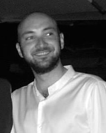

```{r setup, include=FALSE}
knitr::opts_chunk$set(echo = FALSE,
                      message = FALSE,
                      warning = FALSE)
```

```{r packages, include=FALSE}
library(tidyverse)
devtools::load_all()
```

```{r cv, include=FALSE}
cv <- get_online_cv()
cv_data <- import_cv(cv)

bib <- get_publications()
bib <- prepare_bib(bib)
```


Aside
================================================================================

{width=60%}

Contact Info {#contact}
--------------------------------------------------------------------------------

- <i class="fa fa-envelope"></i> mattia.doro@gmail.com
- <i class="fa fa-envelope"></i> mattia.doro@.unipd.it
<!-- - <i class="fa fa-globe"></i> [filippogambarota.xyz](https://filippogambarota.xyz/) -->

::: social

```{r social-links, results='asis'}
format_social(cv_data$links, 2) %>% 
    cat("-", .)
```
:::

Skills {#skills}
--------------------------------------------------------------------------------

- **Coding**: R, MATLAB, Vba, Python, GIT
- **Markup**: Markdown, HTML, CSS
- **Experiments**: E-Prime, PsychoPy
- **EEG Analysis**: Brain Vision Analyzer, EEGLAB/ERPLAB, FieldTrip
- **Operating System**: Linux, Windows

Language Skills {#language}
--------------------------------------------------------------------------------

- **Italian**: native language

- **English**: fluent

Disclaimer {#disclaimer}
--------------------------------------------------------------------------------

```{r, eval=params$pdf_mode, results='asis', echo=FALSE}
glue::as_glue("{width=80%}")
```

Resume made with [**pagedown**](https://github.com/rstudio/pagedown) 

Updated on `r Sys.Date()`

```{r, eval=params$html_mode, results='asis', echo=FALSE}
glue::as_glue("[PDF version](cv.pdf)")
```

Main
================================================================================

Mattia Doro {#title}
--------------------------------------------------------------------------------

### Post-doctoral fellow - [University of Padova](www.unipd.it)

I'm a Cognitive Neuroscientist at the University of Padova. My research
interests are related to visual attention and visual short-term memory.

Education {data-icon=graduation-cap data-concise=true}
--------------------------------------------------------------------------------

```{r education, results='asis'}
cv_data$main_education %>% 
    arrange(order) %>% 
    clean_cv_data() %>% 
    format_all(format_edu)
```

Teaching {data-icon=chalkboard-teacher}
--------------------------------------------------------------------------------

```{r teaching, results='asis'}
cv_data$teaching %>% 
    clean_cv_data() %>% 
    arrange(order) %>% 
    format_all(format_teaching)
```

Training {data-icon=chalkboard-teacher}
--------------------------------------------------------------------------------

```{r training, results='asis'}
cv_data$training %>% 
    clean_cv_data() %>% 
    format_all(format_edu)
```

Papers
--------------------------------------------------------------------------------

```{r publications, results='asis'}
bib %>% 
    filter(type != "Unpublished") %>%  
    arrange(desc(date)) %>% 
    format_all(format_pub)
```

Preprints
--------------------------------------------------------------------------------

```{r preprints, results='asis'}
bib %>% 
    filter(type == "Unpublished") %>%  
    arrange(desc(date)) %>% 
    format_all(format_pub)
```

Conferences {data-icon=file}
--------------------------------------------------------------------------------

```{r conferences, results='asis'}
cv_data$conferences %>% 
    clean_cv_data() %>% 
    arrange(desc(date)) %>% 
    format_all(format_conf)
```

Other Academic Experiences {data-icon=file}
--------------------------------------------------------------------------------

```{r other-academic, results='asis'}
cv_data$other_academic %>% 
    clean_cv_data() %>% 
    arrange(desc(date)) %>% 
    format_all(format_edu)
```


```{css, echo=FALSE}

.pagedjs_page:not(:first-of-type) {
  --sidebar-width: 0rem;
  --sidebar-background-color: #ffffff;
  --main-width: calc(var(--content-width) - var(--sidebar-width));
  --decorator-horizontal-margin: 0.2in;
}
```